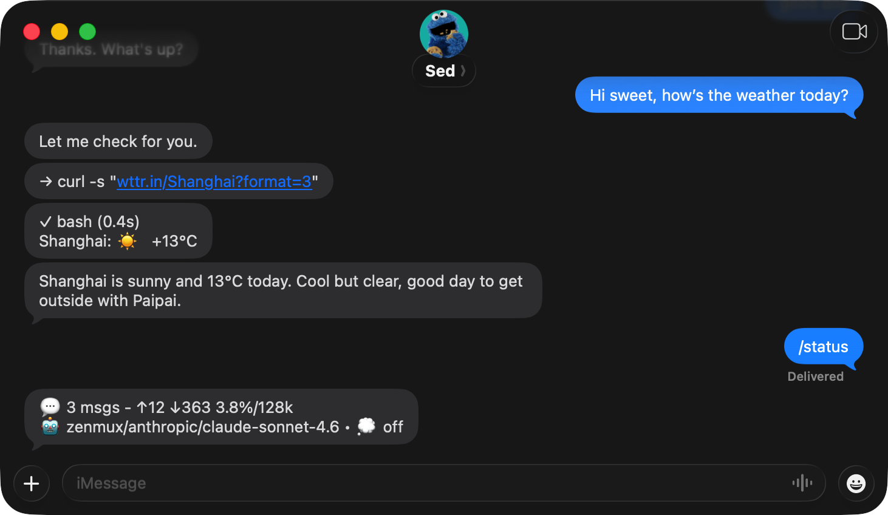

# pi-imessage

A minimal, self-managing iMessage bot powered by [Pi Durable](https://github.com/earendil-works/pi/tree/main/packages/durable).



## Features

- **Minimal**: No BlueBubbles or webhook setup. Runs directly on your Mac alongside Messages.app.
- **Messages**: DMs, SMS, and group chats, with sender identification and reply context.
- **Self-managing**: The agent builds its own tools, with web search, page fetch, and browser access through native tools and skills.
- **Web UI**: Chat history, native task state, scheduled jobs with their latest ten executions, logs, memory, and configuration.
- **Memory**: Searchable, traceable records; corrections preserve history. See [structured memory](docs/memory.md).

## Quick Start

> Just point your Pi coding agent at this README and ask it to set up pi-imessage.

Prerequisites: macOS with Messages.app, Node.js 22.22.2 or newer, Python 3
(shared memory writer), Full Disk Access for the terminal, and an authenticated
[Pi Coding Agent](https://github.com/badlogic/pi-mono/tree/main/packages/coding-agent#quick-start).

```bash
npm install -g @kingcrab/pi-imessage

pi-imessage             # run in foreground
pi-imessage install     # write a launchd job; loading it is a separate operator action
```

Enable replies for your chats by adding their GUIDs to the [settings allowlist](#settings).
For installation and service operations, see [ops/README.md](ops/README.md).
Upgrading from the legacy service? Follow the [migration guide](ops/CUTOVER.md).

## Commands

Send these commands as iMessages:

| Command | Description |
|---|---|
| `/help` | List commands |
| `/new` | Cancel current work and start a fresh conversation |
| `/status` | Show tokens, context usage, and model |
| `/thinking <level\|default>` | Set thinking for this chat or follow the default |
| `/compact` | Compress context without replaying prior work |
| `/run <duration> [task]` | Keep working for up to the given time, e.g. `/run 1h`; `/stop` ends it early |
| `/stop` | Abort current work and stop `/run`; later messages are still answered |
| `/reload` | Refresh models/auth, AGENTS, skills and extensions without cancelling work |

## Configuration

### Settings

Edit `WORKING_DIR/settings.json`. All fields are optional.

```json
{
  "chatAllowlist": {
    "whitelist": ["iMessage;-;+11234567890"],
    "blacklist": ["*"]
  },
  "richText": {
    "enabled": false,
    "markdown": true
  }
}
```

Add chat GUIDs to `whitelist` to enable replies; `blacklist: ["*"]` blocks replies
elsewhere. An explicit blacklist entry takes priority. Messages are always logged.
Rich text is optional; `markdown: true` renders bold spans in direct iMessage chats.

### Scheduler

Context compaction runs every six hours as a Durable background task. To enable
daily English cards, add this to `settings.json` and restart the service:

```json
{
  "scheduledEnglish": {
    "enabled": true,
    "chatGuid": "iMessage;-;+11234567890",
    "time": "07:45",
    "historyFile": "/absolute/path/to/work-english-expressions/used.json"
  }
}
```

Times use the service machine's local timezone. The destination must be reply-enabled. Learning history
is imported once; Durable stores subsequent progress and cards. View next deadlines
and the latest ten executions at `/scheduled`.

### Environment Variables

All variables are optional.

| Variable | Default | Description |
|---|---|---|
| `WEB_ENABLED` | `true` | Set to `false` to disable the built-in web UI |
| `WEB_HOST` | `localhost` | Web UI host |
| `WEB_PORT` | `7750` | Web UI port |
| `WORKING_DIR` | `~/.pi/imessage` | Workspace directory |

### Web and API

See the [HTTP API](docs/api.md) for read-only state and model health checks.
The agent sends files and extra messages with `send_message`. The scheduler
supports daily English cards and six-hour compaction, not arbitrary reminders or cron jobs.

## How It Works

```text
Messages chat.db → Watcher → Pi Durable → Messages.app
```

Each chat has its own conversation, persisted under `WORKING_DIR/durable/`.
Durable resumes pending work after a crash. Agent replies are sent at most once;
uncertain send results are flagged, never automatically resent.

Context is compacted silently every 6 hours and near the model's limit. Failed
compaction keeps the old context. `/new` starts fresh without deleting searchable
history.

## Development

See [AGENTS.md](AGENTS.md) for development rules,
[architecture](docs/architecture.md) for the module layout and execution flow,
and [ADRs](docs/adr/) for design decisions.
