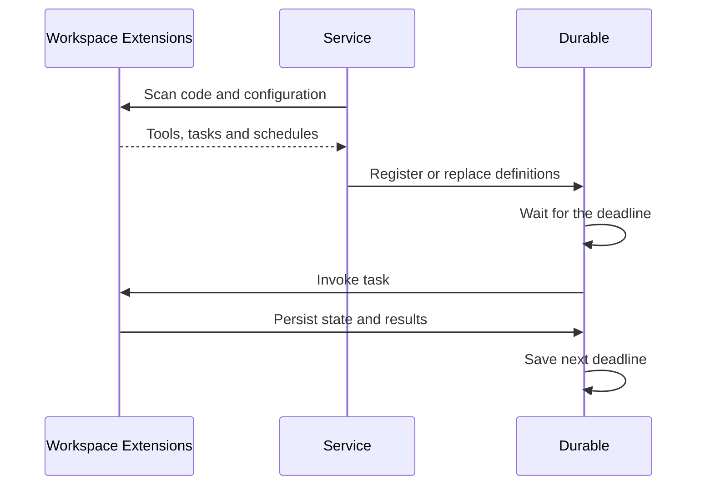

# 0035. Workspace-owned business extensions

Status: accepted

**Problem.** Personal business logic, such as English learning, does not belong
in the reusable messaging framework.

**Example.** Changing a personal task should change a workspace extension, not
framework scheduling, settings, prompts or Web code.

**Decision.**

- Put personal code and configuration in
  `WORKING_DIR/extensions/<name>/index.ts` and `config.json`. Each native Durable
  extension may provide tools, define multiple tasks and optionally schedule them.
  Both the owner and chat assistant may create extensions; add no permission list
  or extra confirmation gate.
- Scan direct child directories at startup and on `/reload`. Reject duplicate
  extension/task names. Validate before replacing definitions; failed reloads keep
  the old definitions. Do not execute skills or attachments as extensions.
- Keep generic daily/interval scheduling, non-overlapping execution, recovery,
  outgoing queues, send receipts and read-only Web history in the framework.
  Six-hour compaction remains built-in maintenance using the same components.
  Durable owns persisted tasks and business state; there is no second pipeline.
- Reload does not interrupt current calls. The next tool/task invocation uses
  new code and configuration; do not proactively reset saved deadlines. Extensions
  provide native migrations when saved task structures change.
- Removing an extension stops future scheduling, not current calls, and retains
  history, business data and receipts. Keep definitions needed by unfinished work
  in memory; missing required task code on restart must fail explicitly.
- Move English code and configuration into its workspace extension. Remove all
  English-specific framework branches and personal job IDs. Preserve existing
  settings, task IDs, checkpoints, deadlines, learning records and send IDs during
  migration; never regenerate saved cards or replay uncertain sends. Verify with
  faux models and temporary storage, then migrate under the single service owner
  with source/configuration rollback copies.

**Consequences.** Workspace extensions are trusted code and need backup with their
configuration. This is the target design, not an implementation claim. It replaces
ADR 0032's embedded English logic; Durable ownership, at-most-once delivery and
ADR 0034's machine-local time rules remain unchanged.
