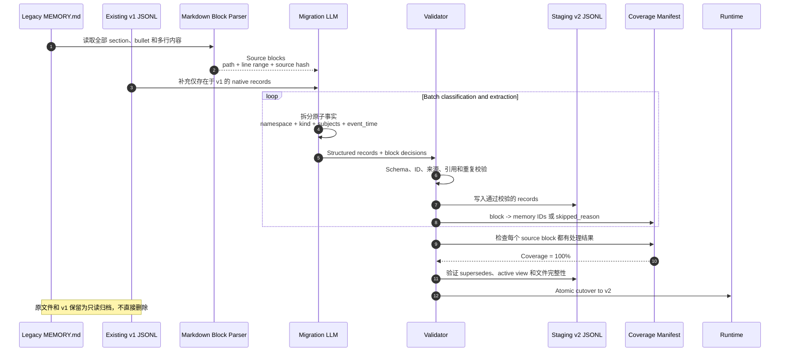
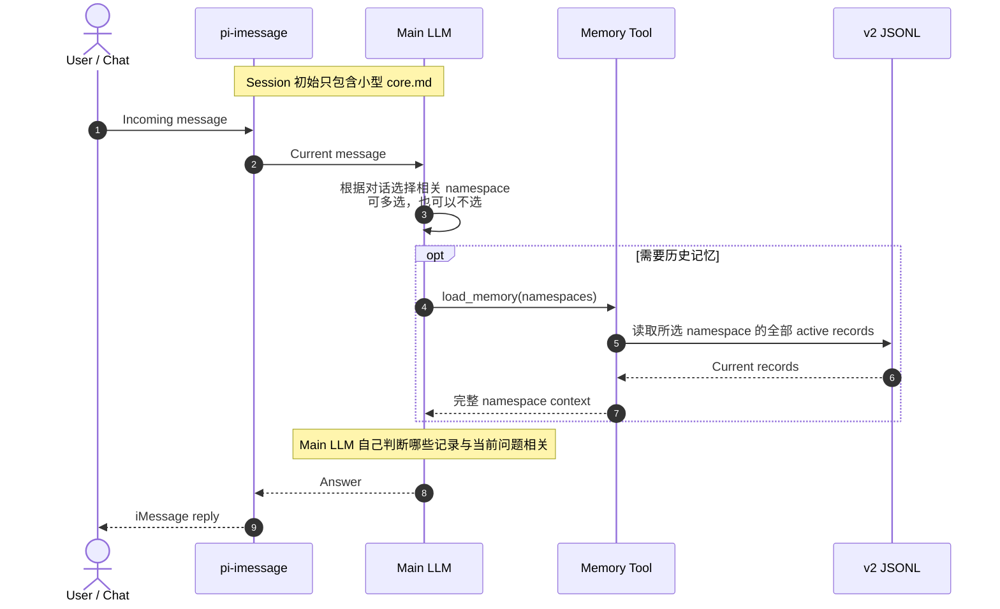
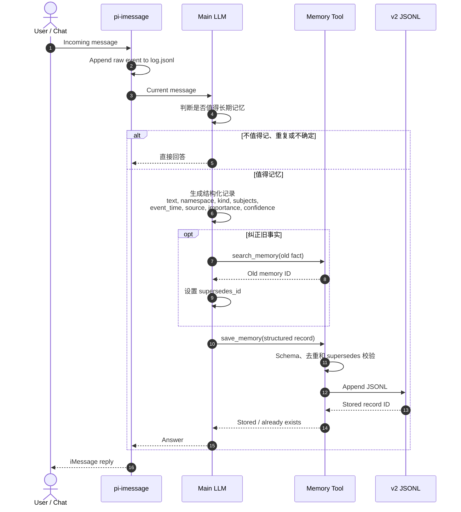

# Structured memory sequence flow

整体分为三部分：一次性全量迁移、运行时动态读取、运行时主动写入。

## 1. One-time full migration

迁移原则：

- “全量”指每个原文 block 都被处理并可追踪，不代表每一行都必须生成一条记忆。
- 无法确认事实日期时使用 `event_time: null`，不伪造日期。
- `namespace` 是运行时加载单元，例如 `health/paipai`、`work/cc`、`project/pi-imessage`。
- `kind` 描述记录类型，例如 `fact`、`event`、`preference`、`procedure`。

## 2. Runtime read

## 3. Runtime write

## Responsibility boundaries

- Main LLM：理解自然语言、选择 namespace、决定是否记忆并生成结构化字段。
- Memory Tool：只做读取、校验、去重、append 和 supersedes，不用关键词理解自然语言。
- v2 JSONL：唯一的结构化 memory source of truth。
- Coverage Manifest：证明旧 MEMORY.md 没有被静默漏迁。
- `core.md`：只保存少量稳定、高频信息。
- Legacy MEMORY.md / v1 JSONL：迁移完成后只读归档。
- 不使用固定关键词分类、Semantic Index、embedding 或 reranker。
