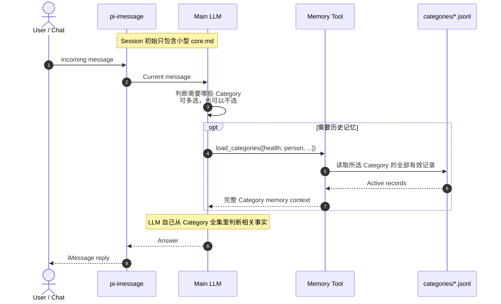
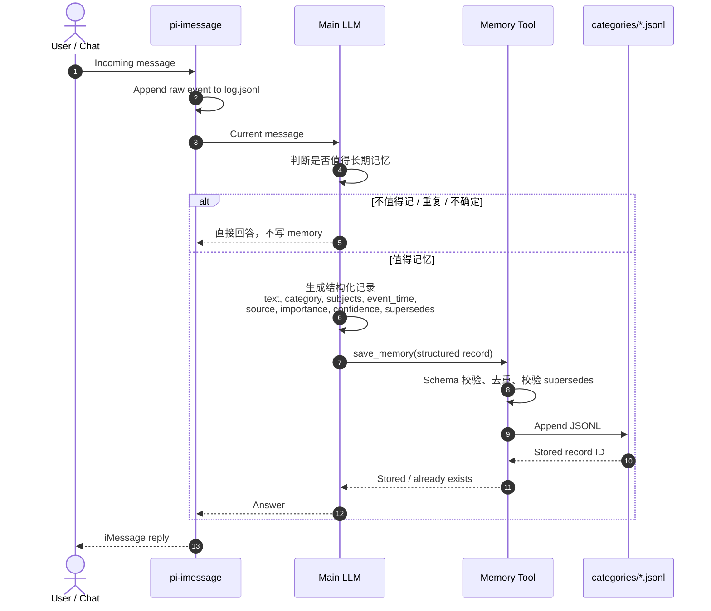

# Structured memory read/write sequence

第一版采用 Category 级动态加载：不在 Session 启动时加载全部记忆，也不做关键词路由或单条记录的语义检索。

Category 由正在聊天的 Main LLM 根据上下文选择；Memory Tool 只按选择结果读取对应 JSONL。

## Read flow

## Write flow

## 关键点

- Main LLM 通过 typed tool 自己选择一个或多个 Category，不需要额外的 classifier LLM。
- Memory Tool 的 Category 参数使用固定 enum，但分类判断来自 LLM，不来自关键词表。
- `load_categories` 返回所选 Category 下的全部有效记录，不做单条记录筛选。
- 同一 Session 已加载过的 Category 不重复注入；文件有更新时只补充 delta，避免 context 线性膨胀。
- JSONL 是 source of truth；`core.md` 只放少量稳定、高频信息；旧 `MEMORY.md` 只读。
- 不使用固定关键词分类、Semantic Index、embedding 或 reranker。
