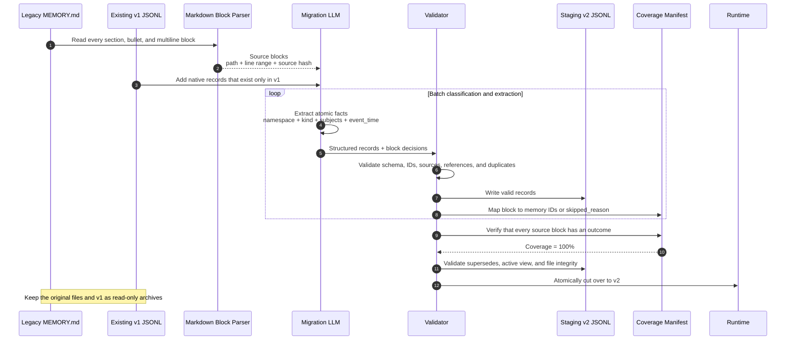
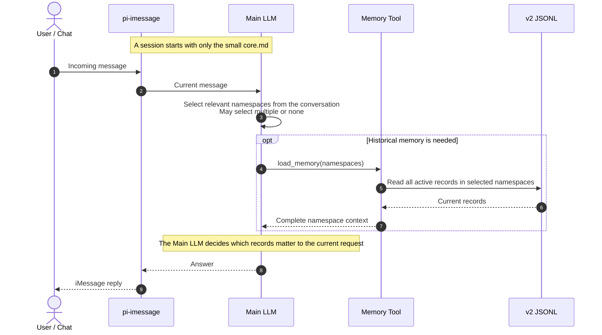
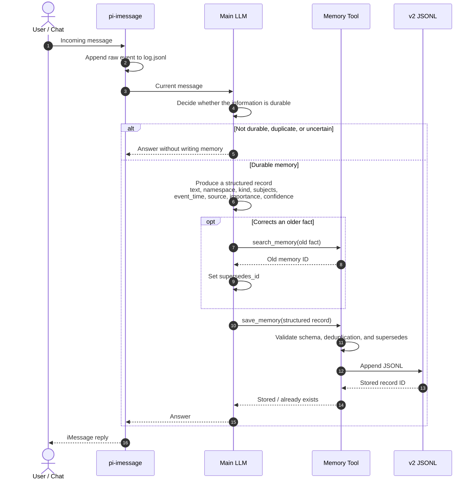
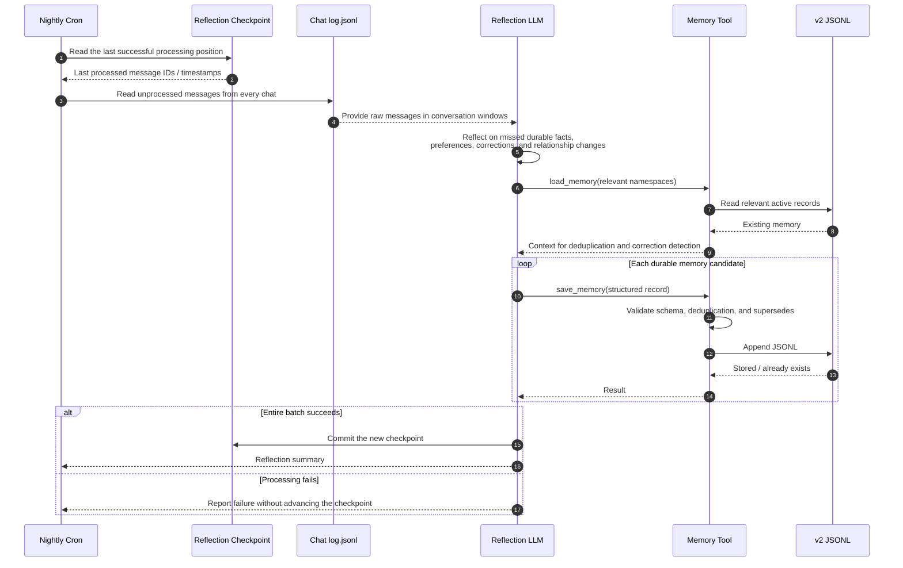

# Structured Memory Sequence Flow

The design has four parts: one-time full migration, runtime reads, runtime writes, and nightly reflection.

## 1. One-time full migration

Migration rules:

- "Full" means every source block is processed and traceable; it does not mean every line must become a memory record.
- Use `event_time: null` when the factual date is unknown. Never invent a date.
- `namespace` is the runtime loading unit, for example `health/paipai`, `work/cc`, or `project/pi-imessage`.
- `kind` describes the record type, for example `fact`, `event`, `preference`, or `procedure`.

## 2. Runtime read

## 3. Runtime write

## 4. Nightly reflection

Reflection rules:

- Runtime writes capture facts promptly; nightly reflection catches omissions, deduplicates, and identifies facts that emerge across multiple messages.
- Use a checkpoint instead of blindly rescanning a fixed 48-hour window. Do not advance it after a failed run, so retries remain safe.
- Reflection and runtime writes share the same `save_memory` path. Neither writes directly to JSONL or legacy `MEMORY.md` files.
- Do not store a whole daily chat summary as memory. Store only durable atomic facts.

## Responsibility boundaries

- Main LLM: understand natural language, select namespaces, decide whether to remember, and produce structured fields.
- Reflection LLM: inspect unprocessed conversations nightly, catch omissions, deduplicate, and identify facts that emerge across messages.
- Memory Tool: read, validate, deduplicate, append, and apply superseding corrections without interpreting natural language through keyword lists.
- v2 JSONL: the sole structured-memory source of truth.
- Coverage Manifest: proves that no legacy `MEMORY.md` source block was silently skipped.
- Reflection Checkpoint: makes nightly processing retryable and prevents silent message loss.
- `core.md`: contains only a small set of stable, frequently needed facts.
- Legacy `MEMORY.md` and v1 JSONL: read-only archives after migration.
- No fixed keyword classifier, semantic index, embedding store, or reranker is used.
