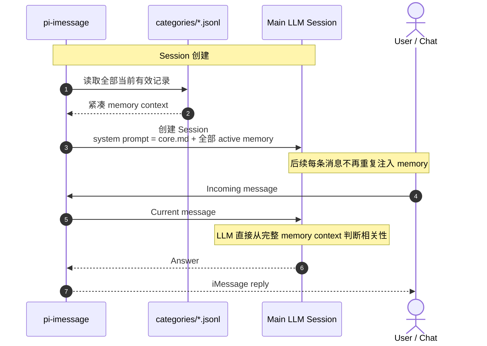
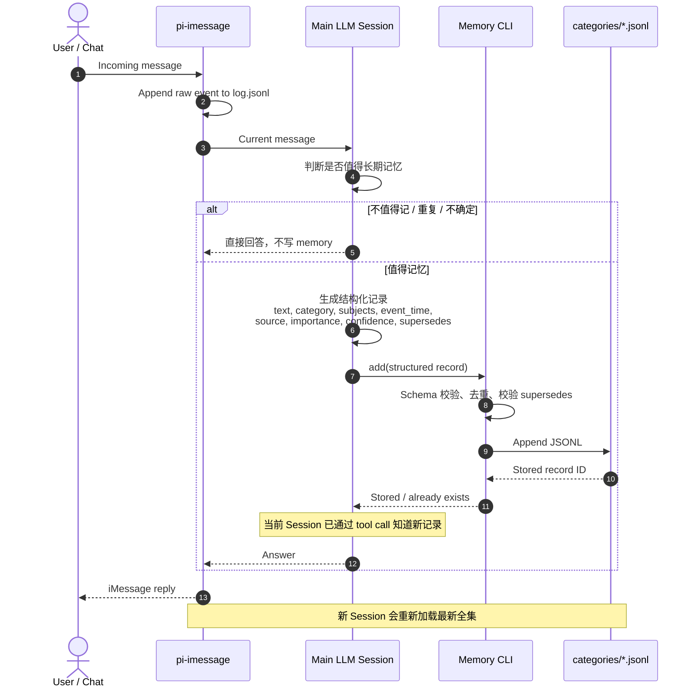

# Structured memory read/write sequence

第一版采用全量加载，不做关键词路由、Semantic Index 或 LLM rerank。

当前约 490 条有效记录，紧凑文本约 5.8 万字符（约 2–3 万 tokens）。只在 session 创建时加载一次，不在每轮消息中重复注入。

## Read flow

## Write flow

## 边界

- Main LLM：理解自然语言，决定是否记忆，并生成 Category、Subjects 等结构化字段。
- Memory CLI：只做确定性的校验、去重和持久化，不用关键词理解自然语言。
- JSONL：结构化记忆的 source of truth。
- `core.md`：只放少量稳定且高频的信息。
- `MEMORY.md`：只读迁移归档。
- 不使用固定关键词分类、Semantic Index、embedding 或额外 reranker。
