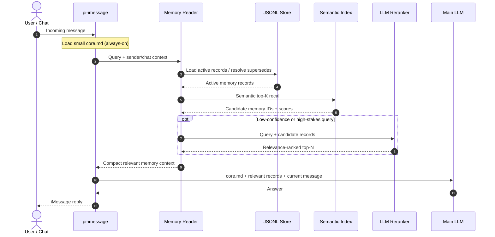
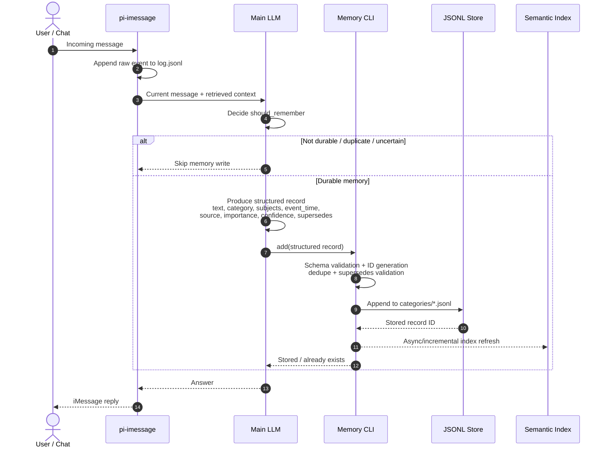

# Structured memory read/write sequence

Design goals:

- The LLM understands and classifies natural language; the storage CLI only validates and persists structured records.
- Category is metadata, not a keyword-based retrieval gate.
- Category JSONL files are the structured source of truth. Semantic indexes and summaries are derived and rebuildable.
- Legacy `MEMORY.md` files are read-only migration archives.

## Read flow

## Write flow

## Responsibility boundaries

| Component | Responsibility | Must not do |
| --- | --- | --- |
| Main LLM | Decide whether a fact is durable; extract atomic text, category, subjects, date, source and correction relationship | Silently overwrite history |
| Memory CLI | Validate schema, generate deterministic IDs, deduplicate and append/supersede records | Interpret natural language with fixed keyword lists |
| JSONL store | Preserve auditable structured memory history | Act as a generated cache |
| Semantic index | Retrieve candidates by meaning | Become a source of truth |
| LLM reranker | Resolve ambiguous relevance when needed | Run unconditionally if semantic scores are already decisive |

Open review decisions:

1. Use local embeddings or a hosted embedding model for the derived semantic index.
2. Invoke the LLM reranker only below a confidence threshold, or on every read.
3. Refresh the semantic index synchronously after a write, or asynchronously in a short debounce window.
