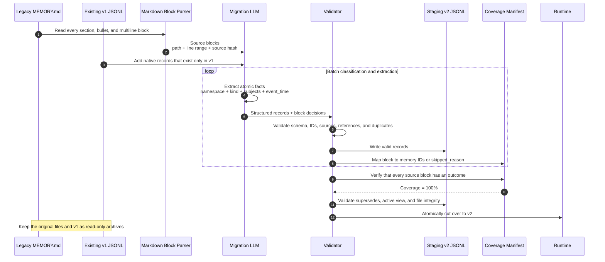
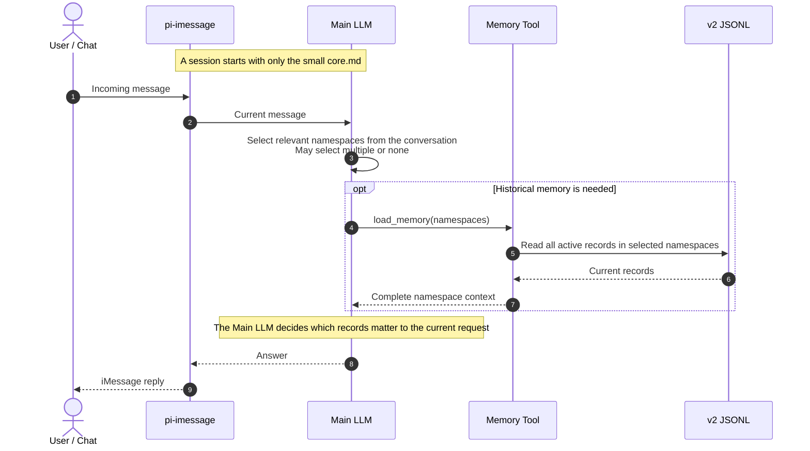
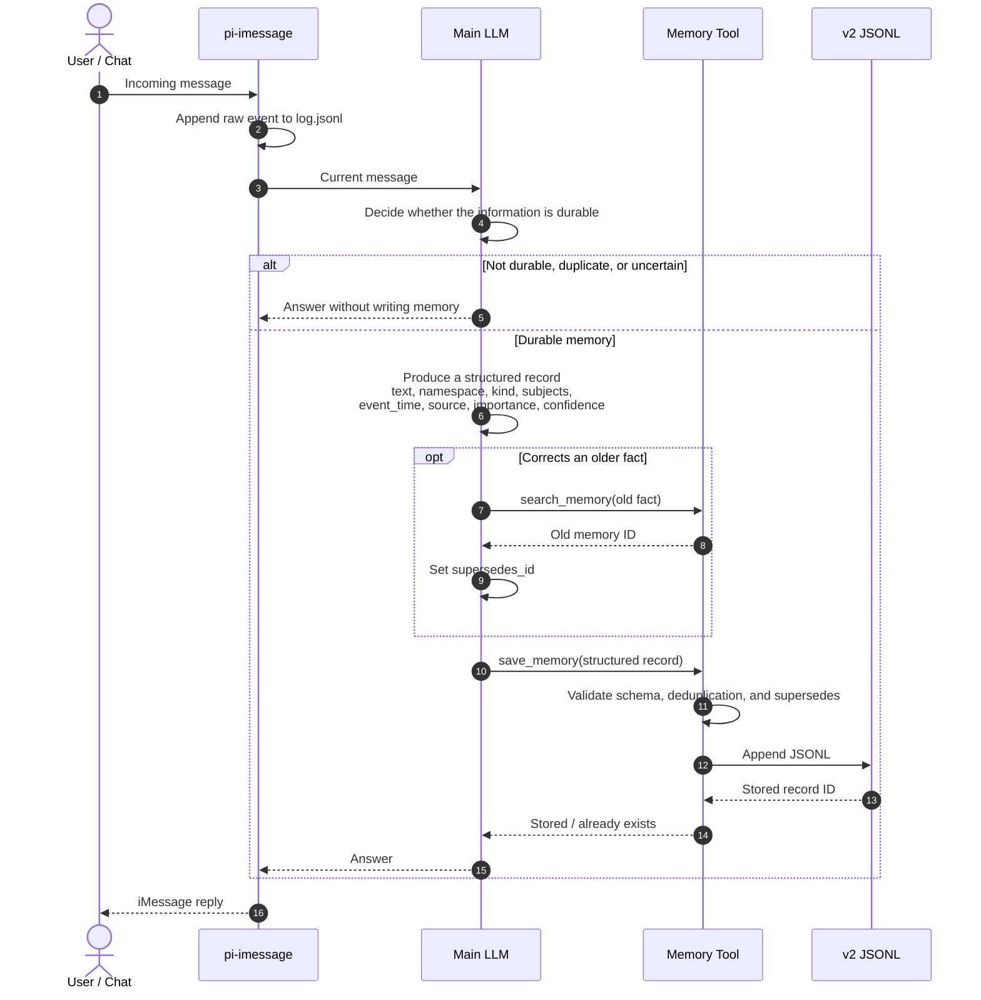
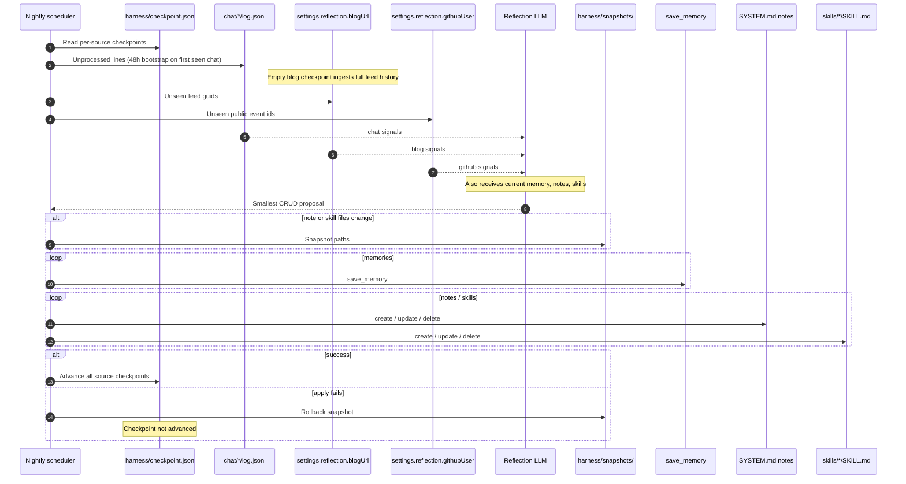

# Structured Memory Sequence Flow

The design has four parts: one-time full migration, runtime reads, runtime writes, and nightly reflection.

## 1. One-time full migration

```mermaid
sequenceDiagram
    autonumber
    participant O as Legacy MEMORY.md
    participant V as Existing v1 JSONL
    participant P as Markdown Block Parser
    participant L as Migration LLM
    participant C as Validator
    participant N as Staging v2 JSONL
    participant M as Coverage Manifest
    participant R as Runtime

    O->>P: Read every section, bullet, and multiline block
    P-->>L: Source blocks<br/>path + line range + source hash
    V->>L: Add native records that exist only in v1

    loop Batch classification and extraction
        L->>L: Extract atomic facts<br/>namespace + kind + subjects + event_time
        L->>C: Structured records + block decisions
        C->>C: Validate schema, IDs, sources, references, and duplicates
        C->>N: Write valid records
        C->>M: Map block to memory IDs or skipped_reason
    end

    C->>M: Verify that every source block has an outcome
    M-->>C: Coverage = 100%
    C->>N: Validate supersedes, active view, and file integrity
    C->>R: Atomically cut over to v2

    Note over O,V: Keep the original files and v1 as read-only archives
```

Migration rules:

- "Full" means every source block is processed and traceable; it does not mean every line must become a memory record.
- Use `event_time: null` when the factual date is unknown. Never invent a date.
- `namespace` is the runtime loading unit, for example `health/paipai`, `work/cc`, or `project/pi-imessage`.
- `kind` describes the record type, for example `fact`, `event`, `preference`, or `procedure`.

## 2. Runtime read

```mermaid
sequenceDiagram
    autonumber
    actor U as User / Chat
    participant P as pi-imessage
    participant A as Main LLM
    participant M as Memory Tool
    participant S as v2 JSONL

    Note over P,A: A session starts with only the small core.md
    U->>P: Incoming message
    P->>A: Current message
    A->>A: Select relevant namespaces from the conversation<br/>May select multiple or none

    opt Historical memory is needed
        A->>M: load_memory(namespaces)
        M->>S: Read all active records in selected namespaces
        S-->>M: Current records
        M-->>A: Complete namespace context
    end

    Note over A: The Main LLM decides which records matter to the current request
    A-->>P: Answer
    P-->>U: iMessage reply
```

## 3. Runtime write

```mermaid
sequenceDiagram
    autonumber
    actor U as User / Chat
    participant P as pi-imessage
    participant A as Main LLM
    participant M as Memory Tool
    participant S as v2 JSONL

    U->>P: Incoming message
    P->>P: Append raw event to log.jsonl
    P->>A: Current message
    A->>A: Decide whether the information is durable

    alt Not durable, duplicate, or uncertain
        A-->>P: Answer without writing memory
    else Durable memory
        A->>A: Produce a structured record<br/>text, namespace, kind, subjects,<br/>event_time, source, importance, confidence
        opt Corrects an older fact
            A->>M: search_memory(old fact)
            M-->>A: Old memory ID
            A->>A: Set supersedes_id
        end
        A->>M: save_memory(structured record)
        M->>M: Validate schema, deduplication, and supersedes
        M->>S: Append JSONL
        S-->>M: Stored record ID
        M-->>A: Stored / already exists
        A-->>P: Answer
    end

    P-->>U: iMessage reply
```

## 4. Nightly reflection

```mermaid
sequenceDiagram
    autonumber
    participant C as Nightly scheduler
    participant K as harness/checkpoint.json
    participant Chat as chat/*/log.jsonl
    participant Blog as settings.reflection.blogUrl
    participant GH as settings.reflection.githubUser
    participant R as Reflection LLM
    participant H as harness/snapshots/
    participant M as save_memory
    participant N as SYSTEM.md notes
    participant S as skills/*/SKILL.md

    C->>K: Read per-source checkpoints
    C->>Chat: Unprocessed lines (48h bootstrap on first seen chat)
    Note over Blog: Empty blog checkpoint ingests full feed history
    C->>Blog: Unseen feed guids
    C->>GH: Unseen public event ids
    Chat-->>R: chat signals
    Blog-->>R: blog signals
    GH-->>R: github signals
    Note over R: Also receives current memory, notes, skills

    R-->>C: Smallest CRUD proposal

    alt note or skill files change
        C->>H: Snapshot paths
    end

    loop memories
        C->>M: save_memory
    end
    loop notes / skills
        C->>N: create / update / delete
        C->>S: create / update / delete
    end

    alt success
        C->>K: Advance all source checkpoints
    else apply fails
        C->>H: Rollback snapshot
        Note over K: Checkpoint not advanced
    end
```

Reflection rules:

- Inputs are chat logs plus optional blog Atom/RSS (`settings.reflection.blogUrl`) and GitHub public events (`settings.reflection.githubUser`). Empty URL/user skips that source. Each source has its own checkpoint.
- First-seen chats and first GitHub pass only review the last 48 hours; older items are marked seen without reflecting.
- Empty blog checkpoint ingests every post currently in the Atom/RSS feed (full available history), then advances `seenGuids`.
- Runtime writes capture facts promptly; nightly reflection catches omissions across chats and external activity.
- Do not advance the checkpoint after a failed run.
- Reflection and runtime writes share `save_memory`. Neither writes directly to JSONL or legacy `MEMORY.md`.
- Do not store a whole daily summary. Store only durable atomic facts.
- Facts / events / preferences → memory. Reusable multi-step workflows → skills (`SKILL.md` only). Standing behavioral instructions → `SYSTEM.md` `# Prompt Notes`.
- Snapshot before note/skill edits. Rollback restores those files; memory stays append-only via `supersedes`.
- Default schedule: local hour 3 (`settings.json` `reflection`). Manual: `/reflect`, `POST /reflect`, `pi-imessage reflect`.

## Responsibility boundaries

- Main LLM: understand natural language, select namespaces, decide whether to remember, and produce structured fields.
- Reflection LLM: inspect unprocessed chats / blog / GitHub signals, catch omissions, deduplicate, and propose small skill / `SYSTEM.md` note updates.
- Memory Tool: read, validate, deduplicate, append, and apply superseding corrections without interpreting natural language through keyword lists.
- v2 JSONL: the sole structured-memory source of truth.
- Coverage Manifest: proves that no legacy `MEMORY.md` source block was silently skipped.
- Reflection Checkpoint: makes nightly processing retryable and prevents silent signal loss across sources.
- Harness snapshots: restore `SYSTEM.md` notes and skills if a reflection apply fails or is rolled back.
- `core.md`: contains only a small set of stable, frequently needed facts.
- Legacy `MEMORY.md` and v1 JSONL: read-only archives after migration.
- No fixed keyword classifier, semantic index, embedding store, or reranker is used.
