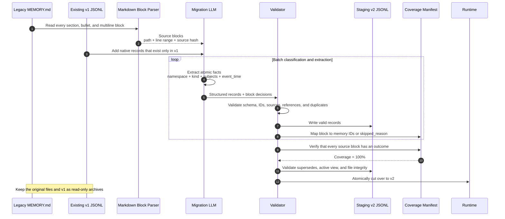
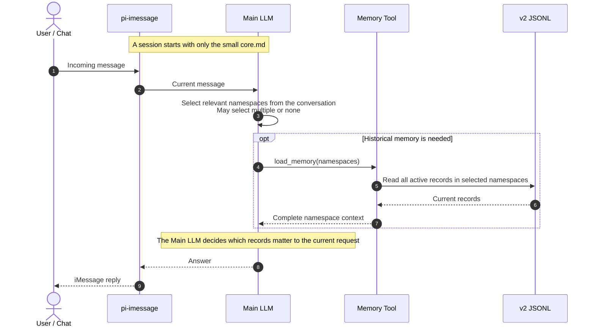
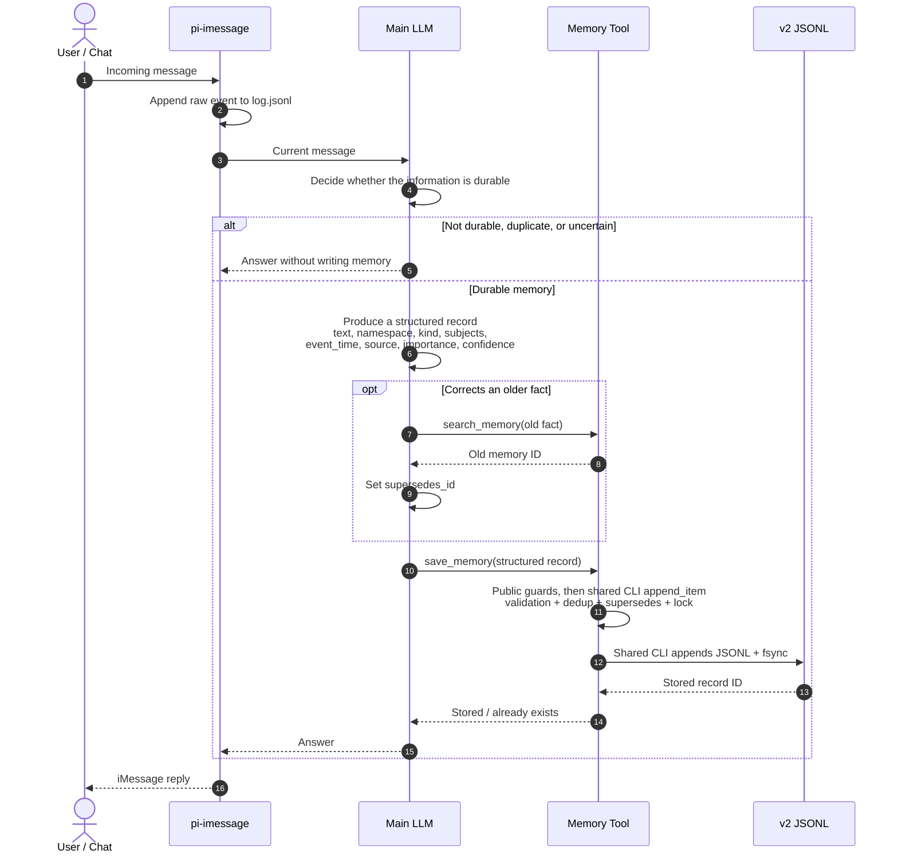
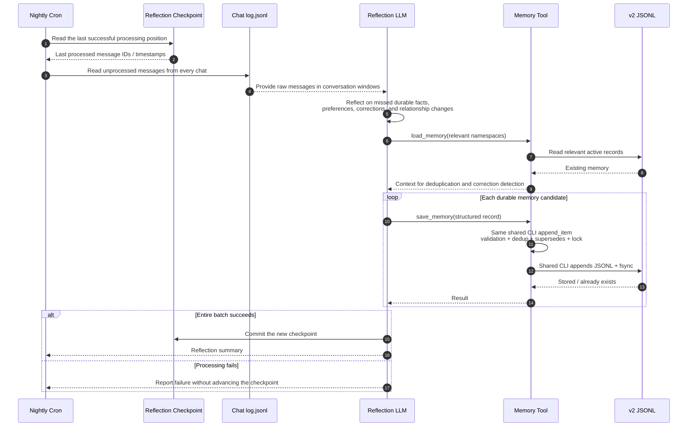

# Structured Memory Sequence Flow

The design has four parts: one-time full migration, runtime reads, runtime writes, and nightly reflection.

## 1. One-time full migration

```mermaid
sequenceDiagram
    autonumber
    participant O as Legacy MEMORY.md
    participant V as Existing v1 JSONL
    participant P as Markdown Block Parser
    participant L as Migration LLM
    participant C as Validator
    participant N as Staging v2 JSONL
    participant M as Coverage Manifest
    participant R as Runtime

    O->>P: Read every section, bullet, and multiline block
    P-->>L: Source blocks<br/>path + line range + source hash
    V->>L: Add native records that exist only in v1

    loop Batch classification and extraction
        L->>L: Extract atomic facts<br/>namespace + kind + subjects + event_time
        L->>C: Structured records + block decisions
        C->>C: Validate schema, IDs, sources, references, and duplicates
        C->>N: Write valid records
        C->>M: Map block to memory IDs or skipped_reason
    end

    C->>M: Verify that every source block has an outcome
    M-->>C: Coverage = 100%
    C->>N: Validate supersedes, active view, and file integrity
    C->>R: Atomically cut over to v2

    Note over O,V: Keep the original files and v1 as read-only archives
```

Migration rules:

- "Full" means every source block is processed and traceable; it does not mean every line must become a memory record.
- Use `event_time: null` when the factual date is unknown. Never invent a date.
- `namespace` is the runtime loading unit, for example `health/paipai`, `work/cc`, or `project/pi-imessage`.
- `kind` describes the record type, for example `fact`, `event`, `preference`, or `procedure`.

## 2. Runtime read

```mermaid
sequenceDiagram
    autonumber
    actor U as User / Chat
    participant P as pi-imessage
    participant A as Main LLM
    participant M as Memory Tool
    participant S as v2 JSONL

    Note over P,A: A session starts with only the small core.md
    U->>P: Incoming message
    P->>A: Current message
    A->>A: Select relevant namespaces from the conversation<br/>May select multiple or none

    opt Historical memory is needed
        A->>M: load_memory(namespaces)
        M->>S: Read all active records in selected namespaces
        S-->>M: Current records
        M-->>A: Complete namespace context
    end

    Note over A: The Main LLM decides which records matter to the current request
    A-->>P: Answer
    P-->>U: iMessage reply
```

## 3. Runtime write

### Shared backend (issue #28)

`src/memory.ts` preserves its exported read functions and async `saveMemory(workingDir, input)` API.
It retains the public input guards, but no longer implements IDs, deduplication, locking,
supersedes checks, or JSONL appends. Those operations call `append_item` in the exact
`memory_cli.py` backend used by the terminal `pi-memory` wrapper. Python 3 is required
on the service PATH; failures reject the write rather than falling back to another writer.
The shared backend also validates actual calendar dates, not only the `YYYY-MM-DD` shape.

- Authoritative source: `daya0576/dotfile`, `pi-config/agent/memory/memory_cli.py`.
- Source file revision: `6bef3d978af37c0ceb0c59587c071eee140ff004` (2026-09-06).
- Uncompressed SHA-256: `df63bf7bc028636803bd7f14914a71d38e569d92006435bfdd71efb66a910dd4`.
- Vendoring: byte-exact gzip/base64 snapshot embedded in `src/memory.ts`, so the existing
  TypeScript build includes it in `dist/memory.js` without package/build changes.
  The regression test decompresses it and pins the hash. Refresh from the authoritative
  file with Python `base64.b64encode(gzip.compress(source_bytes, mtime=0))`, then update
  the revision/hash and run the compatibility tests; never hand-edit backend behavior.

The Python bridge transports JSON over stdin (no shell or CLI-option interpolation),
compiles the unchanged source with a virtual script filename under
`WORKING_DIR/skills/file-memory/`, and invokes its `append_item` function.
That source resolves its store relative to `__file__`, not the process cwd, HOME,
or the terminal wrapper's personal store. It does not create or overwrite a runtime
`memory_cli.py`. All data remains at **`WORKING_DIR/skills/file-memory/namespaces/`**,
and all writers use the existing `.write-lock` in that store.
Existing records and IDs are not migrated or rewritten; content-based backend deduplication
recognizes records produced by the former TS writer even when their hash format differs.
TS continues to provide the thin read/active-view/search adapter, retaining its existing
read ordering and search behavior. Runtime tools and reflection still enter through
`save_memory`; neither gets an independent writer.

Audit: issue #24 and fetched origin/claw history did not contain a completed shared-writer
consolidation commit to port. The completed row in #28 was not evidence of an implementation
in `origin/main`; the authoritative shared CLI was reused instead of inventing a new backend.

```mermaid
sequenceDiagram
    autonumber
    actor U as User / Chat
    participant P as pi-imessage
    participant A as Main LLM
    participant M as Memory Tool
    participant S as v2 JSONL

    U->>P: Incoming message
    P->>P: Append raw event to log.jsonl
    P->>A: Current message
    A->>A: Decide whether the information is durable

    alt Not durable, duplicate, or uncertain
        A-->>P: Answer without writing memory
    else Durable memory
        A->>A: Produce a structured record<br/>text, namespace, kind, subjects,<br/>event_time, source, importance, confidence
        opt Corrects an older fact
            A->>M: search_memory(old fact)
            M-->>A: Old memory ID
            A->>A: Set supersedes_id
        end
        A->>M: save_memory(structured record)
        M->>M: Public guards, then shared CLI append_item<br/>validation + dedup + supersedes + lock
        M->>S: Shared CLI appends JSONL + fsync
        S-->>M: Stored record ID
        M-->>A: Stored / already exists
        A-->>P: Answer
    end

    P-->>U: iMessage reply
```

## 4. Nightly reflection

```mermaid
sequenceDiagram
    autonumber
    participant C as Nightly Cron
    participant K as Reflection Checkpoint
    participant G as Chat log.jsonl
    participant R as Reflection LLM
    participant M as Memory Tool
    participant S as v2 JSONL

    C->>K: Read the last successful processing position
    K-->>C: Last processed message IDs / timestamps
    C->>G: Read unprocessed messages from every chat
    G-->>R: Provide raw messages in conversation windows

    R->>R: Reflect on missed durable facts,<br/>preferences, corrections, and relationship changes
    R->>M: load_memory(relevant namespaces)
    M->>S: Read relevant active records
    S-->>M: Existing memory
    M-->>R: Context for deduplication and correction detection

    loop Each durable memory candidate
        R->>M: save_memory(structured record)
        M->>M: Same shared CLI append_item<br/>validation + dedup + supersedes + lock
        M->>S: Shared CLI appends JSONL + fsync
        S-->>M: Stored / already exists
        M-->>R: Result
    end

    alt Entire batch succeeds
        R->>K: Commit the new checkpoint
        R-->>C: Reflection summary
    else Processing fails
        R-->>C: Report failure without advancing the checkpoint
    end
```

Reflection rules:

- Runtime writes capture facts promptly; nightly reflection catches omissions, deduplicates, and identifies facts that emerge across multiple messages.
- Use a checkpoint instead of blindly rescanning a fixed 48-hour window. Do not advance it after a failed run, so retries remain safe.
- Reflection and runtime writes share the same `save_memory` path. Neither writes directly to JSONL or legacy `MEMORY.md` files.
- Do not store a whole daily chat summary as memory. Store only durable atomic facts.

## Responsibility boundaries

- Main LLM: understand natural language, select namespaces, decide whether to remember, and produce structured fields.
- Reflection LLM: inspect unprocessed conversations nightly, catch omissions, deduplicate, and identify facts that emerge across messages.
- Memory Tool: thin TS reads and write transport; the shared `memory_cli.py` exclusively validates writes, deduplicates, locks, appends, and checks superseding corrections. Neither interprets natural language through keyword lists.
- v2 JSONL: the sole structured-memory source of truth.
- Coverage Manifest: proves that no legacy `MEMORY.md` source block was silently skipped.
- Reflection Checkpoint: makes nightly processing retryable and prevents silent message loss.
- `core.md`: contains only a small set of stable, frequently needed facts.
- Legacy `MEMORY.md` and v1 JSONL: read-only archives after migration.
- No fixed keyword classifier, semantic index, embedding store, or reranker is used.
